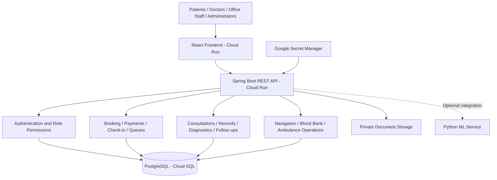

# SmartCare — Hospital & Patient Care Platform

SmartCare connects patients, doctors, office staff and administrators in one hospital workflow—from OPD booking and check-in to consultations, prescriptions, reports and follow-ups.

[Open SmartCare — Live Staging](https://smartcare-frontend-807748718569.asia-south1.run.app/) · [Backend Health](https://smartcare-backend-807748718569.asia-south1.run.app/actuator/health) · [Static Portfolio Demo](https://tausifalam6879.github.io/smartcare-hospital-system/)

The frontend and backend run on Google Cloud Run in Mumbai (`asia-south1`), with PostgreSQL on Cloud SQL. GitHub Pages is a separate browser-only demo. Cloud deployment and basic health have been checked; complete cloud workflow verification is still pending.

## Main Features

- **Patients:** registration, doctor search, OPD booking, queue tracking, health records, report uploads and follow-ups.
- **Doctors:** assigned patient queues, consultations, prescriptions and diagnostic orders.
- **Office staff:** check-in, OPD status, cash/online payment records and daily operations.
- **Administrators:** hospital and doctor management, staff access and operational dashboards.
- **Hospital services:** indoor route guidance, diagnostics, blood-bank availability and ambulance request/dispatch workflows.
- **Care assistant:** patient-scoped record search with source references; optional ML wait estimates.

Patients can register directly. Doctor and staff registration requires an administrator-issued invitation code; the backend checks privileged access.

## System Design



The backend is a modular application. Connected workflows share a database, with transactional booking and inventory updates. Medical records and documents require patient or authorized staff access. The optional ML service runs locally; its cloud deployment has not been verified.

**Patient flow:** Registration → Booking → Payment record → Check-in → Doctor queue → Consultation → Prescription / Reports → Follow-up.

## Tech Stack

| Layer | Technology |
| --- | --- |
| Frontend | React, TypeScript, Vite, Tailwind CSS |
| Backend | Java 17, Spring Boot, Spring Security, JWT |
| Database | PostgreSQL, Flyway migrations |
| Optional ML | Python, FastAPI |
| Deployment | Docker, Cloud Run, Cloud SQL, Secret Manager |

## Run Locally

Requirements: Git and Docker with Docker Compose.

```bash
git clone https://github.com/tausifalam6879/smartcare-hospital-system.git
cd smartcare-hospital-system
cp .env.example .env
```

Set the required database password, JWT secret and payment webhook secret in `.env`. Set `FRONTEND_PORT=5174` and include `http://localhost:5174` in `SMARTCARE_CORS_ORIGINS` for the URLs below. Keep secrets out of Git.

```bash
docker compose up --build -d
```

- Frontend: [http://localhost:5174](http://localhost:5174)
- Backend health: [http://localhost:8080/actuator/health](http://localhost:8080/actuator/health)

Windows PowerShell also supports `Copy-Item .env.example .env`. Optional synthetic data is controlled by `SMARTCARE_DEMO_DATA`; keep it disabled for cloud staging.

## Project Structure

```text
frontend/       React interface
backend/        Spring Boot API and database migrations
ml-service/     Optional Python model API
ml-notebooks/   Model exploration and training
docs/           Setup and verification notes
```

## Current Scope

This is an academic project with a live staging deployment. Online payment uses a development adapter and does not collect real money. Ambulance dispatch provides request/status management; real GPS tracking and a 3D indoor map are not implemented. Wait estimates are approximate, and the care assistant does not diagnose or prescribe.

## Further Details

- [Detailed implementation reference](docs/IMPLEMENTATION-DETAILS.md)
- [Staff access guide](docs/STAFF-ACCESS.md)
- [Desktop role review](docs/DESKTOP-ROLE-REVIEW-2026-10-01.md)
- [Release checklist](docs/RELEASE-CHECKLIST.md)
