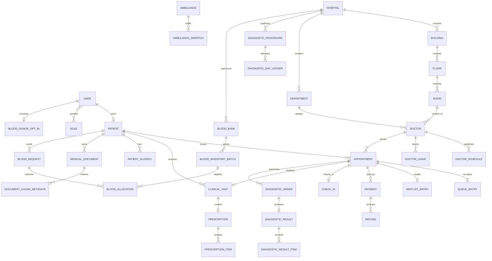

# Database Design

## Entity relationship overview



## Identity and common columns

Business entities use UUID primary keys and expose only those UUIDs. `patient.patient_number` is a separately generated human-facing identifier. Mutable entities include `created_at`, `updated_at`, and an optimistic `version`. Time is stored as UTC timestamps; hospital time zones are IANA zone IDs.

## Phase 1 physical tables

- `users`: mobile/email credentials, BCrypt hash, status, preferred language.
- `user_roles`: normalized enum grants. Later this becomes permission-aware if hospital deployments need custom roles.
- `patients`: one-to-one profile linked to user; staff-created patients may later use a nullable login account and a separate identity record.
- `hospitals`: code, name, address, contact, time zone, active flag.
- `departments`: hospital-scoped code/name; unique per hospital.
- `doctors`: hospital/department membership, registration number, consultation fee, capacity, duration, public location description.
- `doctor_schedules`: day of week, local start/end times, slot duration, optional capacity override; overlapping rules are validated in the service and later hardened with PostgreSQL exclusion constraints.
- `audit_logs`: append-only event metadata; ordinary application endpoints cannot update or delete rows.

## Phase 2 physical tables

- `doctor_day_ledgers`: one row per doctor/date with effective capacity, active count, and monotonic next position.
- `appointments`: patient/doctor/date request, queue position, payment preference, expiry timestamps, and lifecycle state.
- `waitlist_entries`: FIFO sequence and waiting/promoted/cancelled state linked one-to-one to a waitlisted appointment.

## Phase 3 physical tables

- `payments`: one payment ledger per appointment with provider reference, verified transaction ID, receipt, and status.
- `refunds`: one durable refund request per successful payment, completed only by a verified provider event.
- `payment_webhook_events`: provider/event uniqueness, payload hash, outcome, and provider timestamp without storing card data.

## Phase 4 physical tables

- `check_ins`: one audited check-in per appointment with channel, verifier, timestamp, and random privacy token.
- `notifications`: patient-owned event messages with a stable deduplication key and read timestamp.
- `notification_deliveries`: one attempt per notification/channel with delivered, failed, or explicitly not-configured outcome.
- `appointments` adds checked-in, consultation-started, completed, and no-show timestamps plus the corresponding lifecycle states.

## Phase 5 physical tables

- `hospital_locations`: hospital-scoped stable code, bilingual names, location type, building/floor/zone/room, and schematic coordinates.
- `navigation_paths`: verified bidirectional graph edge with forward/reverse English and Hindi instructions, distance, duration, and step-free status.
- `qr_checkpoints`: public random/stable QR code attached one-to-one to a verified location; it contains no patient data.

Database constraints reject cross-free coordinates, identical edge endpoints, non-positive distance/duration, duplicate hospital location codes, duplicate edge pairs, and duplicate checkpoint codes. Service validation additionally requires every edge and checkpoint node to belong to the selected hospital.

## Phase 6 physical tables

- `doctors.linked_user_id`: optional one-to-one login identity for clinician-only record actions.
- `clinical_visits`: one append-only finalized clinician record per appointment, including symptoms, diagnosis, notes, discharge summary, follow-up, and actor/time metadata.
- `prescriptions`: optional one-to-one prescription header per visit.
- `prescription_items`: ordered structured medicine, dosage, frequency, duration, route, and instructions.
- `patient_allergies`: patient safety item with clinician, appointment, severity, status, reaction, and recorder provenance.
- `medical_documents`: patient/hospital metadata plus original safe filename, detected MIME type, byte count, opaque private storage key, SHA-256, document date, uploader, and verification status. File bytes are not stored in PostgreSQL.

Constraints enforce a single visit per appointment, a single prescription per visit, a single user-to-doctor link, valid allergy/document states, and the 10 MB metadata ceiling. Visit records have no update/delete endpoint in Phase 6; corrections require a future explicit amendment workflow rather than silently rewriting history.

## Queue-critical constraints implemented in Phase 2

```text
UNIQUE appointments(doctor_id, service_date, queue_position)
UNIQUE appointments(patient_id, idempotency_key)
UNIQUE doctor_day_ledgers(doctor_id, service_date)
UNIQUE waitlist_entries(doctor_id, service_date, sequence_number)
CHECK active_count <= effective_capacity
```

Provider transaction IDs and webhook event IDs are unique. Historical cancelled and expired appointments remain available for patient history and audit.

## Patient-isolated RAG

Phase 7 adds:

- `ai_conversations`: patient-owned thread title and last activity timestamp.
- `ai_messages`: private user/assistant content, grounded flag, and explicit safety classification.
- `ai_knowledge_index_states`: one patient/source index state with source hash and non-sensitive extraction result.
- `document_chunk_metadata`: patient/hospital/source ownership, optional visit/document foreign key, page, citation label, text, model version, serialized vector, content hash, and extracted-text flag.
- `ai_message_citations`: ordered immutable link between an assistant message and the exact retrieved chunk.

Every chunk carries `patient_id`, `hospital_id`, source key, page/section citation, content hash, and embedding-model version. Retrieval starts with an authorization-derived patient scope included in the database predicate before vector ranking. Application-side filtering after retrieval is not accepted because it could expose another patient's content to the ranker or a future model. Uniqueness constraints prevent duplicate source chunks and duplicate citation order.

## Phase 8 physical tables

- `diagnostic_procedures`: hospital-owned laboratory and imaging catalogue entries with preparation guidance, location, daily capacity, duration, and active state.
- `diagnostic_day_ledgers`: one procedure/date allocation row with effective capacity, active reservations, and a monotonic next queue position.
- `diagnostic_orders`: clinician-authorized patient request linked to the qualifying appointment and selected procedure, including priority, clinical indication, scheduling, queue position, and lifecycle state.
- `diagnostic_results`: one immutable verified summary per order with flag, verifier, verification time, and provenance.
- `diagnostic_result_items`: ordered structured measurements with result value, unit, reference range, and item-level flag.

Constraints prevent duplicate procedure codes per hospital, duplicate day ledgers, multiple results per order, and duplicate queue positions for a procedure/date. Pessimistic locks on the procedure and day-ledger rows serialize first-day creation and capacity allocation. Cancelling a scheduled order releases active capacity without reusing its queue position.

## Phase 9 physical tables

- `blood_banks`: hospital-authorized internal or partner facilities with operational contact, distance, transfer estimate, source provenance, and active/authorized flags.
- `blood_inventory_batches`: exact ABO/Rh group and component, batch reference, expiry, total/reserved units, verification state/time, and staff verifier.
- `blood_requests`: patient/hospital/optional appointment context, creating clinician/staff account, exact group/component, requested/matched units, urgency, state, clinical reason, and creator-scoped idempotency key.
- `blood_allocations`: one request-to-batch reservation with units and reserved/fulfilled/released state.
- `blood_donor_opt_ins`: explicit user consent, contact preference, independently verified group/eligibility, verifier, and withdrawal timestamp.

Checks enforce `0 <= reserved_units <= total_units` and `0 <= matched_units <= requested_units`. Inventory candidates are pessimistically locked and allocated by distance then earliest expiry (FEFO). The unique request/batch allocation prevents duplicate reservations, and cancellation releases every active allocation in the same transaction. Availability excludes quarantined, expired, and verification-stale batches.

## Phase 10 physical tables

- `ambulances`: hospital, unique registration/call sign, vehicle state, crew label/contact, coarse area, optional exact coordinates, location timestamp, active flag, and synthetic-data provenance.
- `ambulance_requests`: optional patient, hospital, requester, assigned vehicle, patient/blood transport type, priority, pickup/contact details, idempotency key, lifecycle state, and dispatch/acknowledgement/completion/cancellation timestamps.
- `ambulance_request_events`: append-only from/to status timeline with actor, safe note, and event time.

The requester/idempotency unique key makes retried request creation safe. Pessimistic locks on both request and vehicle serialize assignment and prevent one available ambulance from being dispatched twice. Database checks constrain every enum and coordinate range; the domain state machine allows only the next operational stage. Patient queries use `patient_id`, while exact coordinates and crew contact are mapped only by the dispatcher fleet response. Completion or an allowed cancellation releases the vehicle in the same transaction.

## Phase 11 physical tables

- `doctor_day_operations`: one doctor/date row containing hospital, operational status, derived delay minutes, safe patient-facing reason, actor, and operational timestamp.
- `appointment_recovery_cases`: one case per affected confirmed appointment containing patient, immutable original queue-position snapshot, patient choice, approved target doctor/date, and decision/resolution timestamps.

Doctor/date and appointment uniqueness prevent duplicate operational state and duplicate recovery prompts. Cancellation for the day does not mutate an appointment. Only a patient-owned decision invokes the existing locked capacity ledger; the original capacity is released and the target capacity is guaranteed in the same transaction. Refund selection records `REFUND_REVIEW_REQUIRED` and never fabricates gateway success.

## Phase 12 physical tables

- `blood_group_image_analyses`: patient/hospital ownership, private opaque storage metadata, SHA-256, model-attempt state, Anti-A/Anti-B/Anti-D observations, preliminary reaction-derived group, independent verified group, rejection details, actors, and timestamps.

Database checks limit content types, file size, model confidence, lifecycle values, verified/rejected completeness, and observer/verifier separation. The stored image path never appears in API DTOs. A verified analysis remains a review artifact and is not automatically written into a patient's longitudinal clinical blood group.

## Retention and deletion

Clinical retention varies by jurisdiction and hospital policy. Retention is policy-driven, legal holds override deletion, and audit records are append-only. Account deactivation does not erase clinical records. Data export/deletion requests are workflows with authorization and recorded outcomes, not direct table deletes.
